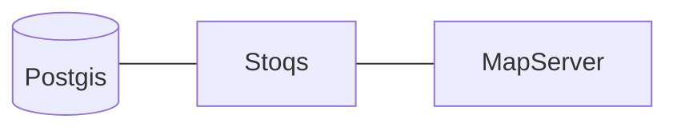

# capstone_stoqs
CSUMB Otterbots capstone project.

### Description: 
> STOQS is a geospatial database and web application designed to give oceanographers efficient integrated access to in situ measurement and ex situ sample data. 

The objective of this project is to restructure the [stoqs system](https://github.com/stoqs/stoqs) to fit the [Django-cookiecutter](https://github.com/cookiecutter/cookiecutter-django) Template.

### Problem statement: 
- The current development version of STOQS is designed to run within a vagrant VM which makes it challenging to easily edit the code with a local IDE and see the changes refreshed live in the browse
- Django-cookiecutters use of docker containers sharing volumes with the local machine will hopefully make it easier for contributors to get started and make changes to STOQS

### Project Diagram

